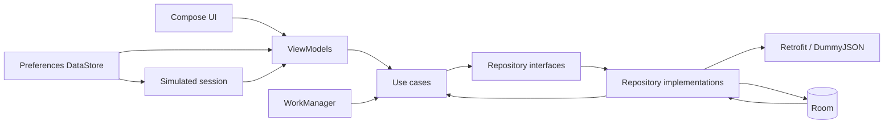

# User List App

User List App is an offline-first Android directory backed by the DummyJSON users API. Remote profiles stay immutable; favorites and personal notes are local user-owned data.

## Features

- User list with local case-insensitive search, A–Z/Z–A sorting, favorites filter, manual refresh, and pull-to-refresh
- Cached offline content with distinct initial-loading, refresh, empty, and error behavior
- User details with accessible avatar fallback, favorite toggle, and explicitly saved local notes
- System/light/dark theme selection and persistent background-sync setting
- Unique network-constrained daily WorkManager synchronization with visible work state and last-success time
- Transactional Room refresh that preserves notes and favorites, including a real version 1 → 2 migration
- Simulated DummyJSON authentication (`emilys` / `emilyspass`) with Guest and Account states
- Material 3 bottom navigation between protected Users and Account
- Android SplashScreen held only while the local session is restored
- Android Photo Picker account-avatar override with no broad media/storage permission

Users and user details are protected: a signed-out user sees an authentication-required prompt instead of cached content, and neither foreground refresh nor periodic synchronization performs a users request. Signing in opens Users and enables daily synchronization when that setting is enabled. Signing out clears protected navigation while preserving cached users, favorites, and notes.

This authentication is intentionally a demonstration, not production-ready authentication. Only the authenticated DummyJSON user ID is persisted—never a username, password, access token, or refresh token. The optional local account-avatar URI is also persisted so the Photo Picker selection can be restored. It overrides only the Account photo, is never uploaded, and can be removed independently.

## Screenshots

Runtime screenshots require launching the application on an emulator or physical device.

| Users | User details | Settings |
|---|---|---|
| _Screenshot placeholder_ | _Screenshot placeholder_ | _Screenshot placeholder_ |

## Architecture

The app is a single Gradle application module with package boundaries. Compose has no data-source access; all screens use hoisted state and lifecycle-aware `StateFlow` collection.



Room is the single source of truth for displayed users. A refresh maps the limited remote DTO into entities and updates the snapshot in a transaction. Stale remote users are removed only when they have no local favorite or note. Preferences DataStore persists theme, background-sync enablement, last successful sync timestamp, simulated authenticated user ID, and optional local account-avatar URI. A centralized coordinator combines the session and setting flows before scheduling unique WorkManager work.

## Technology

Kotlin, Coroutines/Flow, Jetpack Compose Material 3, Navigation Compose, AndroidX SplashScreen and Photo Picker, Hilt, Retrofit/OkHttp, Kotlin Serialization, Coil, Room, Preferences DataStore, WorkManager, JUnit, MockK, coroutine test, Turbine, AndroidX Test, and Compose UI test.

## Project structure

- `core/common`: typed results and application errors
- `domain`: models, repository contracts, and use cases
- `data/remote`: constrained API DTOs and Retrofit source
- `data/local`: Room entities, DAO, database, migration, transactional source
- `data/preferences`: DataStore settings repository
- `data/repository`: offline-first repository and mappings
- `feature`: list, details, and settings UI/ViewModels
- `feature/account`: Guest, sign-in modal, Account, and Photo Picker UI
- `worker`: periodic sync worker and scheduler
- `di`: dependency graph

## Build and run

Requirements: JDK 17 and Android SDK 37. Open the repository in Android Studio or run:

```bash
./gradlew assembleDebug
```

Install `app/build/outputs/apk/debug/app-debug.apk`, then launch while online for the initial refresh. Cached profiles, favorites, and notes remain usable offline.

## Testing

```bash
./gradlew testDebugUnitTest
./gradlew lintDebug
./gradlew compileDebugAndroidTestKotlin
./gradlew connectedDebugAndroidTest
```

Unit coverage includes the session-aware refresh boundary, authentication ViewModel states, sign out/avatar clearing, combined sync coordination, and a MockK-based `UserListViewModel` test in addition to the existing fake-based suite. Connected tests require a running emulator or attached device. Real DummyJSON sign-in, the system Photo Picker, splash appearance, and visual review require an Android runtime.
