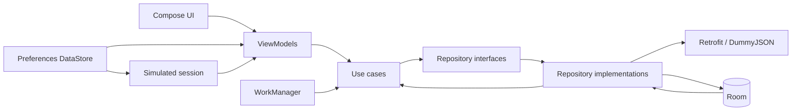

# User List App

User List App is an offline-first Android directory backed by the DummyJSON users API. Remote
profiles stay immutable; favorites and personal notes are local user-owned data.

## Features

- User list with local case-insensitive search, A–Z/Z–A sorting, favorites filter, manual refresh,
  and pull-to-refresh
- Cached offline content with distinct initial-loading, refresh, empty, and error behavior
- User details with accessible avatar fallback, favorite toggle, and explicitly saved local notes
- System/light/dark theme selection and persistent background-sync setting
- Settings delivered on demand as a Play Feature Delivery dynamic feature
- Unique network-constrained daily WorkManager synchronization with visible work state and
  last-success time
- Transactional Room refresh that preserves notes and favorites, including a real version 1 → 2
  migration
- Simulated DummyJSON authentication (`emilys` / `emilyspass`) with Guest and Account states
- Material 3 bottom navigation between protected Users and Account
- Android SplashScreen held only while the local session is restored
- Android Photo Picker account-avatar override with no broad media/storage permission

Users and user details are protected: a signed-out user sees an authentication-required prompt
instead of cached content, and neither foreground refresh nor periodic synchronization performs a
users request. Signing in opens Users and enables daily synchronization when that setting is
enabled. Signing out clears protected navigation while preserving cached users, favorites, and
notes.

This authentication is intentionally a demonstration, not production-ready authentication. Only the
authenticated DummyJSON user ID is persisted—never a username, password, access token, or refresh
token. The optional local account-avatar URI is also persisted so the Photo Picker selection can be
restored. It overrides only the Account photo, is never uploaded, and can be removed independently.

## Screenshots

Runtime screenshots require launching the application on an emulator or physical device.

| Users                    | User details             | Settings                 |
|--------------------------|--------------------------|--------------------------|
| _Screenshot placeholder_ | _Screenshot placeholder_ | _Screenshot placeholder_ |

## Architecture

The app has a base application module, a platform-independent `core:navigation` contract module,
a regular `feature:account` Android library, and an on-demand `settings` dynamic-feature module.
Compose has no data-source access; all screens
use hoisted state and lifecycle-aware `StateFlow` collection. The base module requests Settings
through Play Feature Delivery and exposes its Hilt-owned use cases through an application entry
point, avoiding a dependency from the base app to feature code. Feature code and the navigation
host both depend on route contracts; features never depend back on the navigation host.


```mermaid
flowchart LR
    UI[Compose UI] --> VM[ViewModels]
    VM --> UC[Use cases]
    UC --> RI[Repository interfaces]
    RI --> R[Repository implementations]
    R --> API[Retrofit / DummyJSON]
    R --> DB[(Room)]
    DB --> R
    R --> UC
    DS[Preferences DataStore] --> VM
    DS --> AUTH[Simulated session]
    AUTH --> VM
    WM[WorkManager] --> UC
```

Room is the single source of truth for displayed users. A refresh maps the limited remote DTO into
entities and updates the snapshot in a transaction. Stale remote users are removed only when they
have no local favorite or note. A response that carries no users is rejected as invalid data
whenever the cache is populated, so a malformed but successful response can never clear the
snapshot. Preferences DataStore persists theme, background-sync enablement, last successful sync
timestamp, simulated authenticated user ID, and optional local account-avatar URI, and an unreadable
preferences file is replaced with empty preferences instead of failing every read. A centralized
coordinator combines the session and setting flows before scheduling unique WorkManager work.

## Technology

Kotlin, Coroutines/Flow, Jetpack Compose Material 3, Navigation Compose, AndroidX SplashScreen and
Photo Picker, Hilt, Retrofit/OkHttp, Kotlin Serialization, Coil, Room, Preferences DataStore,
WorkManager, Firebase Performance Monitoring, Firebase Crashlytics, AndroidX JankStats, JUnit,
MockK, coroutine test, Turbine, AndroidX Test, and Compose UI test.

## Project structure

- `core/common`: typed results and application errors
- `core:navigation`: serializable route contracts shared by navigation hosts and features
- `domain`: models, repository contracts, and use cases
- `data/remote`: constrained API DTOs and Retrofit source
- `data/local`: Room entities, DAO, database, migration, transactional source
- `data/preferences`: DataStore settings repository
- `data/repository`: offline-first repository and mappings
- `feature`: list, details, and settings UI/ViewModels
- `feature:account`: modular Account UI and minimal presentation contract
- `app/feature/account`: temporary legacy Account, shared authentication orchestration, and the
  replaceable migration flag
- `worker`: periodic sync worker and scheduler
- `core/quality`: Firebase adapter, custom traces, Crashlytics context, and JankStats aggregation
- `di`: dependency graph
- `settings`: on-demand Settings Activity, Compose UI, ViewModel, and feature-local tests

## Build and run

Requirements: JDK 17 and Android SDK 37. Open the repository in Android Studio or run:

```bash
./gradlew :app:bundleDebug
```

The resulting `app/build/outputs/bundle/debug/app-debug.aab` contains the base app and the on-demand
`settings` feature. Deploy the bundle through Android Studio with the Settings dynamic feature
selected for local development, or through a Play testing track to verify the real download flow.
Cached profiles, favorites, and notes remain usable offline.

### Release signing

The project already contains the Gradle configuration required to sign release APKs and app
bundles, but it deliberately does not distribute a shared private key. Debug builds, tests, and
normal Android Studio development do not require any additional signing files.

To produce a signed release from a clone or fork, each engineer should generate their own
`release.jks`, copy `keystore.properties.template` to `keystore.properties`, and fill in their local
keystore password, key alias, and key password. Gradle automatically enables the release signing
configuration when these files are present in the repository root.

Both `release.jks` and `keystore.properties` are ignored by Git and must not be committed. Back them
up in a secure password manager or encrypted archive if builds signed with that key need to be
updated later. Without the local files, release code can still be compiled, but the resulting
release artifact is unsigned and cannot be installed or uploaded to Google Play until it is signed.

```bash
keytool -genkeypair -keystore release.jks -alias user-list-upload \
  -keyalg RSA -keysize 4096 -validity 10000
cp keystore.properties.template keystore.properties
# Fill in keystore.properties with the credentials entered above.
./gradlew :app:bundleRelease
```

## App Quality Monitoring

The selected flow is initial, manual, retry, and background synchronization of the users list.
It crosses the network, DTO mapping, Room snapshot replacement, and Compose loading/content/error
states, so it provides useful signals without instrumenting artificial work.

| Tool                 | Signal                                                                                                    | Expected diagnostic value                                                                                                 |
|----------------------|-----------------------------------------------------------------------------------------------------------|---------------------------------------------------------------------------------------------------------------------------|
| Firebase Performance | Automatic app start, activity rendering, and HTTP/S request traces                                        | Identify slow startup, rendering, or DummyJSON requests by device, OS, and app version                                    |
| Firebase Performance | `users_refresh` duration trace; `trigger`, `result`, and `error_type` attributes; `users_received` metric | Separate initial/manual/retry/background work and determine whether latency or failure correlates with a specific trigger |
| JankStats            | Per-frame state plus `ui_jank_session` totals for `total_frames` and `janky_frames`                       | Locate jank during loading, refresh, search/filter, or content rendering                                                  |
| Crashlytics          | Fatal crashes, ANRs, explicit logs and custom keys                                                        | Reconstruct the current operation and refresh trigger before a stability event                                            |
| Crashlytics          | Non-fatal invalid-data, storage, and unknown failures                                                     | Surface actionable unexpected failures without treating normal offline/HTTP errors as crashes                             |

JankStats state is deliberately bounded to `screen`, `phase`, `interaction`, and a bucketed visible
user count. Monitoring never includes names, email addresses, user IDs, search text, credentials,
avatar URIs, or note content. Expected network and HTTP failures remain normal application results
and are represented by trace attributes and logs rather than non-fatal Crashlytics issues.

### Firebase configuration

Debug uses the `com.example.userlistapp.debug` application ID and its Firebase Android client from
`app/src/debug/google-services.json`. Release keeps `com.example.userlistapp` and uses
`app/google-services.json`. Both clients belong to the same Firebase project, while remaining
separately identifiable and installable side by side. Firebase is enabled by the normal build:

```bash
./gradlew :app:bundleDebug
```

Development crashes and performance events still reach the shared Firebase project, so filter by
the debug app where applicable and keep deliberate test events limited to development devices.

### Development verification

1. Build and install the Firebase-enabled debug APK on an emulator/device with Google Play services.
2. Sign in, open Users, trigger pull-to-refresh, search/filter and scroll, then background the app.
3. Confirm Performance events and JankStats output:

   ```bash
   adb logcat -s FirebasePerformance
   adb logcat -s UserListJank
   ```

4. Generate a debug-only non-fatal event:

   ```bash
   adb shell am broadcast \
     -a com.example.userlistapp.QUALITY_NON_FATAL \
     -n com.example.userlistapp/com.example.userlistapp.QualityTestReceiver
   ```

5. Generate the initial Crashlytics test crash:

   ```bash
   adb shell am broadcast \
     -a com.example.userlistapp.QUALITY_CRASH \
     -n com.example.userlistapp/com.example.userlistapp.QualityTestReceiver
   ```

6. Relaunch the app so queued crash/non-fatal reports can be uploaded, then inspect the Firebase
   Performance and Crashlytics dashboards. Delivery is asynchronous and can take several minutes.

The verification receiver exists only in the debug source set. No crash control is shipped in
release. Crashlytics can collect ANRs on supported
Android versions, but this demo intentionally does not add a main-thread blocking ANR trigger.
Reproduce ANRs only on a dedicated test device or inspect naturally collected reports. JankStats
itself has no backend; Logcat retains detailed state-level development reports, while the aggregated
session metrics are sent through the `ui_jank_session` Performance trace when Firebase is enabled.
Google Analytics is deliberately omitted: explicit Crashlytics logs and keys provide the required
context without enabling Analytics collection solely for automatic breadcrumbs.

## Testing

```bash
./gradlew testDebugUnitTest
./gradlew :settings:testDebugUnitTest
./gradlew lintDebug
./gradlew compileDebugAndroidTestKotlin
./gradlew connectedDebugAndroidTest
./gradlew validateDebugScreenshotTest
```

Unit coverage includes the session-aware refresh boundary, authentication ViewModel states,
sign out/avatar clearing, combined sync coordination, property-based invariants, and ViewModel
behavior.

Connected tests require an emulator or attached device. The reference environment is the API 37
medium-phone AVD with `en-US`, default density, and default font scale. Component tests use Compose
semantics, while `MainActivityFlowTest` launches the real activity and navigation graph with
Hilt-bound in-memory repositories. The flow is deterministic and never accesses DummyJSON, Room,
DataStore, or WorkManager.

Compose Test APIs provide node discovery, actions, assertions, synchronization, and
Espresso-backed idling for application UI. The Photo Picker cancellation test crosses into Android
system UI, so it uses UI Automator on the same API 37 AVD. It identifies the transition by package
ownership rather than device-specific picker text, presses system Back, waits for the application
package to become visible, and confirms that neither the fake repository nor the rendered Account
state received an avatar. The test intentionally does not select real media: doing so would require
seeding device-owned storage and would make the result dependent on emulator state.

Screenshot tests use the experimental official Compose Preview Screenshot Testing plugin with a
`0.0001` image-difference threshold and run host-side through Layoutlib. Five deliberately limited
references cover the user list in light and dark themes, the user list at `fontScale = 1.3`, the
sign-in validation state, and user details. All previews use a 393 x 852 dp viewport. References
are stored in `app/src/screenshotTestDebug/reference`; validation diffs are written to
`app/build/reports/screenshotTest/preview/debug/index.html`.

To review an intentional visual change:

1. Run `./gradlew validateDebugScreenshotTest` and inspect the HTML diff.
2. Confirm that every changed pixel is expected.
3. Run `./gradlew updateDebugScreenshotTest`.
4. Review and commit the updated PNG references with the UI change.

Keep screenshot execution on JDK 17 with the repository's pinned AGP, Compose BOM, and screenshot
plugin. Layoutlib does not reproduce every device-specific renderer, system surface, or OEM font,
so connected behavior tests remain necessary. Behavior tests verify interactions and state
transitions; screenshot tests verify rendering and must not replace behavior assertions.
